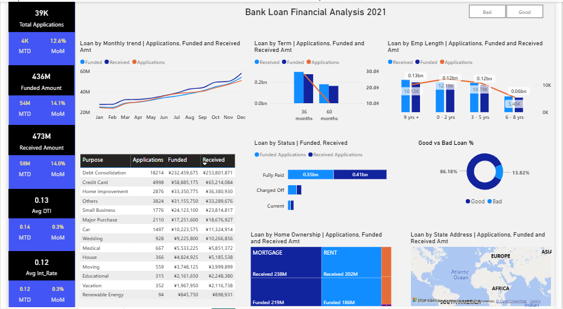
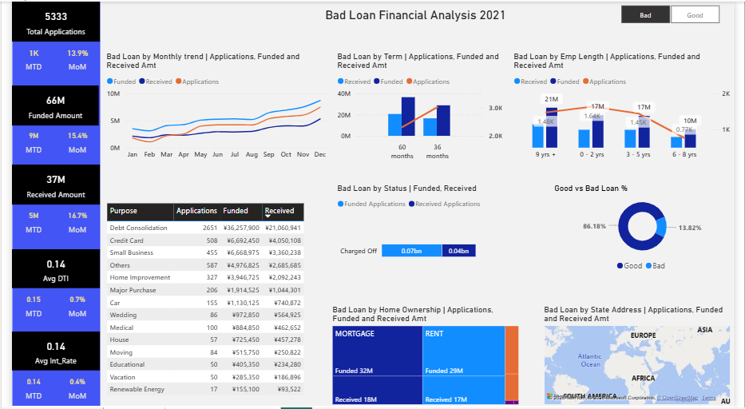
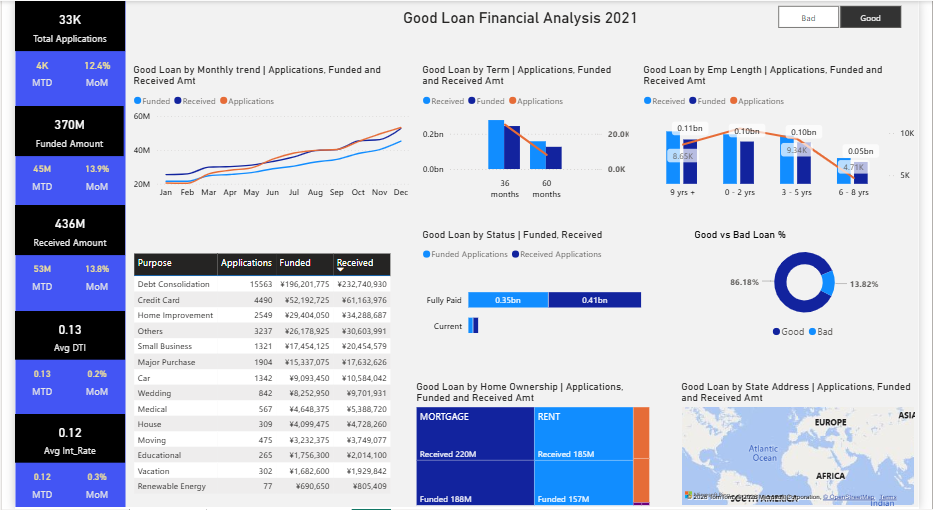

# Financial-Analysis

##   Table of Contents

- [Project brief](#Projectbrief)
- [Questions](#Questions)
- [Data source](#Datasource)
- [Tools](#Tools)
- [Dashboards](#Dashboard)
- [Chart types and why](#ChartTypesandWhy?)
- [Stages](#Stages)
- [Data Transformation](#DataTransformation)
- [Findings](#Findings)
- [Recommendations](#Recommendations)
- [challenges&solution](#Chalenges&Solution)

## Project brief 

This project features a 3 page, interactive Power BI dashboard designed for Plant Co. to monitor global performance across three key business pillars: Sales, Quantity, and Gross Profit.

The dashboard provides a detailed breakdown experience, allowing stakeholders to identify not just what happened, but why it happened by comparing Month to Date (MTD) performance against the Month over Month (MoM).

Developed a comprehensive Bank Loan Intelligence System that analyzes over $435M in loan data to monitor portfolio health and borrower risk. By visualizing key metrics like a 13.3% average DTI and identifying Debt Consolidation as the primary loan driver, this project provides actionable insights to improve lending strategies and maintain a 86.2% Good Loan rate.

### Benefit of data modeling

- Improves query performance and report responsiveness

- Simplifies DAX logic by enforcing a single-direction filter flow

- Ensures accurate time-intelligence calculations

- Follows industry best practices for Power BI and enterprise BI solutions.

## Questions

- How is the overall loan portfolio performing? (Answered by the 86.2% Good Loan vs. 13.8% Bad Loan split).

- What is the total financial exposure and recovery status? (Answered by the $435.8M Funded Amount vs. the $473.1M Total Amount Received).

- Are we maintaining a healthy profit margin? (Answered by the 12.0% Average Interest Rate compared to the volume of funded loans).

- What is the average financial burden on our borrowers? (Answered by the 13.3% Average Debt-to-Income (DTI) ratio).

- Which loan types are most likely to fail? (Answered by the "Bad Loan" breakdown in the Summary dashboard).

- Are longer-term loans riskier than shorter ones? (Answered by the Term breakdown—36 months vs. 60 months—on the Overview page).

- What is our "ideal" customer profile? (Answered by the Employment Length and Home Ownership charts).

- What are the primary drivers for people seeking credit? (Answered by the "Loan Purpose" chart, e.g., Debt Consolidation).

- Does job stability correlate with loan volume? (Answered by the breakdown of applications from people with 10+ years of work history).

- Is the demand for loans growing or shrinking? (Answered by the "Total Loan Applications by Month" line chart).

- Where is our business geographically concentrated? (Answered by the "Loan Applications by State" map).

- Are we seeing a month-over-month (MoM) improvement in collections? (Answered by the MoM percentage indicators on the Summary cards).

- Which specific individuals or accounts require immediate follow-up? (Answered by the Details table, allowing managers to see specific loan statuses and payment dates).

- How are different grades of loans (A, B, C, etc.) performing across the board? (Answered by the Grade and Sub-Grade filters in the detailed report).

## Data Source

## Tools

| Tools | Purpose | 
| --- | --- | 
| Power BI | DAX, Power Query | 

## Stages 
- Load data to Power Query, Standardize data-types and remove duplicates.
- Create a custom 'slicer' as a toggle button to view across 2 pillars of business. (Good and Bad Loans), and to return "All" if slicer is cleared.
- Wrote DAX measures to calculate for Dynamic report.

## Chart types and Why? 

- Card Visuals - Shows the KPIs metrics (Applications, Funded and Received amount, Avg DTI and Int Rate, MTD & MoM), and also the dynamic report title.

- Table Charts - Shows the application, funded and received by loan purpose.

- Treemap - Shows the application, funded and received loans by home ownership.

- Map - Used to depict the geo location of loan borrowers / applicants. 

- Column Bar (Combo) - Shows the categorical distribution of loans by employment length.

- Bar - It display the categorical distribution of loan status between Charged off (Bad), Current and Fully Paid (Good).

- Line - It is used to show the monthly trends of applications, funded, and received amount. 

## Dashboard
 
 This dashboard allows the Sales Director to pivot from 'General Observation' to 'Targeted Action' for example, specifically investigating the November slump or renegotiating low-margin accounts identified in the scatter plot.

## Data Transformation

Here are the Key DAX formulas used in this project:

- Applications = 
VAR FilterState = [Loan Quality_Filter]
RETURN
CALCULATE(
    COUNT(financial_loan[Id]),
    FILTER(
    financial_loan,
        FilterState = 0 ||
        (FilterState = 1 && financial_loan[Loan Quality] = "Good") ||
        (FilterState = 2 && financial_loan[Loan Quality] = "Bad")
    )
)

   - This measure count all loans applications.  

- Funded  = 
VAR FilterState = [Loan Quality_Filter]
RETURN
CALCULATE(
    SUM(financial_loan[Loan_Amount]),
    FILTER(
    financial_loan,
        FilterState = 0 ||
        (FilterState = 1 && financial_loan[Loan Quality] = "Good") ||
        (FilterState = 2 && financial_loan[Loan Quality] = "Bad")
    )
)

   - This measure total all funded amount. 

- Received = 
VAR FilterState = [Loan Quality_Filter]
RETURN
CALCULATE(
    SUM(financial_loan[Total_Payment]),
    FILTER(
    financial_loan,
        FilterState = 0 ||
        (FilterState = 1 && financial_loan[Loan Quality] = "Good") ||
        (FilterState = 2 && financial_loan[Loan Quality] = "Bad")
    )
)

   - This measure sums the payment from loan borrowers.

- Avg Int = 
VAR FilterState = [Loan Quality_Filter]
RETURN
CALCULATE(
    AVERAGE(financial_loan[Int_Rate]),
    FILTER(
    financial_loan,
        FilterState = 0 ||
        (FilterState = 1 && financial_loan[Loan Quality] = "Good") ||
        (FilterState = 2 && financial_loan[Loan Quality] = "Bad")
    )
)

   - This measure is used to calculate the AVG Int Rate

- Avg DTI = 
VAR FilterState = [Loan Quality_Filter]
RETURN
CALCULATE(
    AVERAGE(financial_loan[DTI]),
    FILTER(
    financial_loan,
        FilterState = 0 ||
        (FilterState = 1 && financial_loan[Loan Quality] = "Good") ||
        (FilterState = 2 && financial_loan[Loan Quality] = "Bad")
    )
)

  - This measure is used to calculate the AVG DTI 

## Findings

1. 86.2% of all loans are "Good Loans" (Fully Paid or Current), totaling $370.2M in funded value.

2. Most borrowers are highly stable, with 10+ years of employment history and living in rented or mortgaged homes.

3. Debt Consolidation is by far the most common reason people apply for loans, followed by Credit Card payments.

4. There is a clear upward trend in loan applications from the start of the year toward the end (peaking in December).

5. About 13.8% of loans are "Bad Loans" (Charged Off), which represents roughly $65.5M in total funded amount.

## Recommendations

1. Create marketing campaigns specifically for employees with 10+ years of experience, as they are your most active and reliable customers.

2. Since this is the #1 loan purpose, offer a streamlined "Express" approval process for debt consolidation to capture more market share.

3. Focus marketing spend on California (CA), Texas (TX), and New York (NY), as these states show the highest demand and volume.

4. Investigate the "60-month" loan terms more closely; longer terms often carry higher risks. Consider stricter credit requirements for 5-year loans.

## Challenges & Solution 

1. The stakeholders needed to see Sales, Quantity, and Gross Profit performance, but putting all three on one page created a cluttered and "noisy" dashboard that was hard to read.

    - How I solved it: I created a "Slicer Table" for easy toggling between 3 key pillars of business using DAX. This allowed the user to switch the entire context of the page with one click, maintaining a clean and simple report while providing three times the analytical depth.

2. Standard YTD functions can sometimes fail if the fiscal calendar is non-standard or if there are gaps in the data, leading to misleading variance figures.

    - How I solved it: I created a Date Table and utilized SAMEPERIODLASTYEAR combined with TOTALYTD logic to ensure the waterfall charts accurately show comparisons for the $512K sales variance.

3. With hundreds of accounts, a standard bar chart was insufficient for identifying profitability outliers.

    - How I solved it: I used a Scatter Plot with a Profitability Quadrant. By adding a constant line at the 20K sales mark and a GP% axis, I created an instant visual diagnostic tool to separate "High-Volume/Low-Margin" accounts from "Premium" partners.

